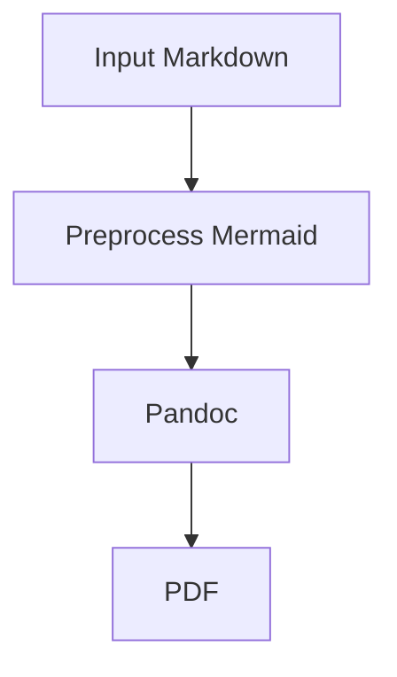

# md2pdf

Convert Markdown documents to polished PDFs with **Pandoc**, **XeLaTeX**, and **Mermaid** support, packaged as a simple **Nix flake**.

This project is designed for Markdown documents that need more than a barebones export. It handles:

- title pages from frontmatter
- Mermaid diagrams rendered as high-quality PDF graphics
- long, dense comparison tables
- improved wrapping for narrow table columns
- sensible page geometry and Unicode-capable fonts
- underlined, clickable links in the final PDF

## Features

- **Single-command PDF generation** with `nix run`
- **Mermaid fenced block support** via preprocessing
- **XeLaTeX-based PDF output** for strong typography and Unicode support
- **Wide-table handling** with column-width tuning and table-cell wrapping
- **Readable page layout** with practical margins and full-width content usage
- **Clickable, underlined hyperlinks** that remain identifiable in print
- **Title page generation** from Markdown frontmatter

## Usage

Run directly from the flake:

```bash
nix run . -- doc.md
```

Write to a specific output file:

```bash
nix run . -- doc.md -o doc.pdf
```

Open a development shell and use the generated command directly:

```bash
nix develop
md2pdf doc.md -o doc.pdf
```

## Example frontmatter

Use standard YAML frontmatter at the top of your Markdown document:

```yaml
---
title: Example Document Title
subtitle: Example Document Subtitle
author:
  - Your Name
date: 2026-04-19
---
```

If `title` is present, a title page is generated automatically.

## Mermaid support

Mermaid diagrams should be written as fenced code blocks:

````md

````

During conversion, Mermaid blocks are rendered to PDF using `mmdc` and then embedded into the final document as vector graphics.

## How it works

The pipeline is:

1. Python reads the source Markdown.
2. YAML frontmatter is parsed for title-page metadata.
3. Mermaid fenced blocks are rendered to PDF.
4. Minor preprocessing is applied for LaTeX-sensitive text.
5. Pandoc converts the processed Markdown to LaTeX/PDF.
6. XeLaTeX produces the final PDF.

In addition, a Lua filter adjusts table behavior so wide comparison tables and narrow columns degrade more gracefully.

## Design notes

This project intentionally favors **document quality and practical robustness** over minimalism.

### Why Pandoc + XeLaTeX

Pandoc provides a strong Markdown-to-LaTeX pipeline, while XeLaTeX gives:

- better Unicode handling
- better font control
- more predictable PDF output for complex academic or technical documents

### Why Mermaid is rendered separately

Mermaid diagrams are pre-rendered before Pandoc sees the document. This avoids fragile downstream handling and ensures diagrams can be embedded as proper graphics rather than raw diagram text.

### Why the table filter exists

Large technical tables often break default PDF exports. This project adds logic to:

- estimate better relative column widths
- allow long tokens to wrap in narrow cells
- reduce overlap between neighboring columns

### Why links are underlined

Color-only hyperlinks are easy to miss in grayscale or print. Underlining preserves clickability in PDFs while still making references visually obvious on paper.

## Requirements

This flake bundles the required tooling, including:

- Python
- Pandoc
- Mermaid CLI
- XeLaTeX via `texliveFull`

You do not need to install them manually if you are running through Nix.

## Project structure

At a high level, the flake builds an `md2pdf` command that coordinates:

- a Python preprocessing script
- a Pandoc invocation
- a Lua filter for table handling
- a LaTeX header include for typography and layout
- Mermaid CLI for diagram rendering

## Caveats

- The project currently uses `texliveFull` for simplicity rather than a minimized TeX closure.
- Mermaid preprocessing targets fenced `mermaid` code blocks.
- Extremely large or very dense tables may still benefit from manual rewriting or splitting.
- This tool is optimized for technical reports and research-style documents, not arbitrary Markdown edge cases.

## Recommended use cases

`md2pdf` works especially well for:

- technical reports
- research briefs
- architecture documents
- project specifications
- policy writeups
- Markdown documents with diagrams and wide comparison tables

## Troubleshooting

### A Mermaid diagram does not render correctly

Confirm that the diagram is written as a fenced `mermaid` block and that Mermaid CLI is available through the flake environment.

### LaTeX fails on special characters

The pipeline already handles some common Markdown-to-LaTeX friction points, but highly unusual content may still require escaping or preprocessing.

### Tables still feel too cramped

The current filter improves many cases automatically, but some tables are simply too dense for portrait layout. In those cases, consider:

- shortening column text
- splitting the table
- rotating selected tables to landscape in a future extension

## Future improvements

Potential next steps include:

-[x] landscape support for especially wide tables
-[] a smaller TeX dependency set
-[] configurable page size and margins
-[] optional bibliography and citation support
-[] support for additional diagram preprocessors

## License

This project is licensed under the [GNU GPLv3](./LICENSE)
