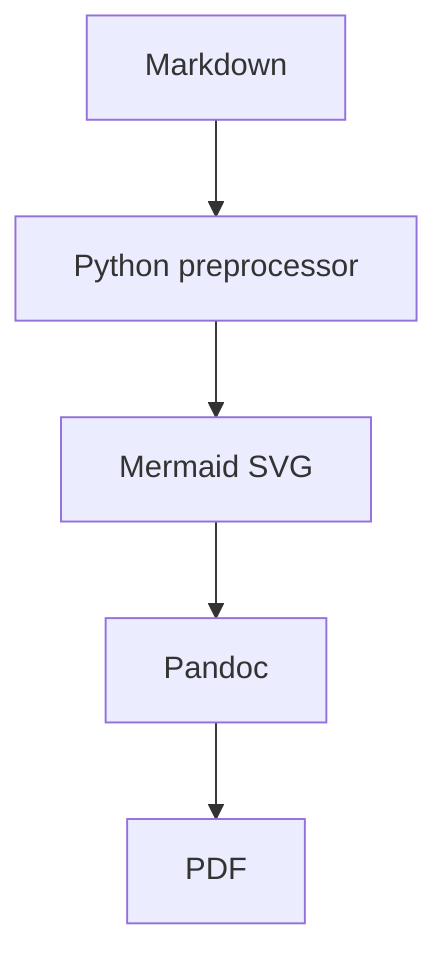

# Overview

This is a simple report.

## Long table

| Column A | Column B | Column C |
|---|---|---|
| A very long row that should wrap properly across pages if needed | More content | Even more content |
| Another long row | More text | More text |

## Mermaid

